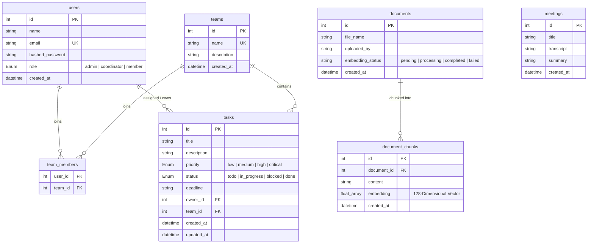

# OpsPilot — Technical Architecture Specification

This document provides a transparent, highly detailed, and completely honest breakdown of the actual technologies, algorithms, schemas, and simulation layers running inside the **OpsPilot** codebase. 

Rather than describing abstract cloud infrastructures, this specification documents the **absolute truth** of how the local RAG engine, vector similarity calculations, async task queues, database models, and user interfaces are built and run offline on your machine.

---

## 🚀 Monorepo System Topography

```mermaid
graph TD
    subgraph Frontend Client [React 19 & Vite]
        A[App.jsx Shell] --> B[Dashboard.jsx Bento]
        A --> C[TeamWorkspace.jsx Kanban]
        A --> D[AIQuery.jsx Chat Console]
        A --> E[Reports.jsx Analytics]
        D --> F[PromptConsole.jsx Pill Shorts]
        A --> G[Login.jsx Portal]
        A --> H[Edit Profile Modal]
        A --> I[Sun/Moon Theme Toggle]
        
        LocalStorage[(Browser LocalStorage)] <--> A
    end

    subgraph FastAPI Backend Gateway [Python 3.10+]
        J[main.py Router Base] --> K[auth.py Controller]
        J --> L[teams.py Controller]
        J --> M[tasks.py Controller]
        J --> N[docs.py Document API]
        J --> O[query.py AI Query API]
        J --> P[meetings.py Meeting API]
        
        N --> Q[ai_service.py Core Engine]
        O --> Q
        P --> Q
        
        Q --> R[Local Sliding Chunking]
        Q --> S[Local 128-Dim Dot Product Cosine Similarity]
        Q --> T[Regex Action Item Parser]
        Q --> U[Local Markdown LLM Synthesizer]
        
        SecretKey[(.secret_key Local Cache)] --> J
    end

    subgraph Celery Asynchronous Engine [Background Worker]
        W[celery_app.py App Base] --> X[tasks.py Worker Tasks]
        X --> Y[process_document_chunking_task]
        X --> Z[extract_meeting_action_items_task]
    end

    subgraph Message Broker & Result Storage
        Broker[(Redis Container / Postgres SQLA Broker Fallback)]
        DB_Result[(PostgreSQL DB Result Store)]
    end

    subgraph PostgreSQL Database [Port 5433 Host / 5432 Container]
        DB_U[users Table]
        DB_T[teams Table]
        DB_TM[team_members Table]
        DB_TK[tasks Table]
        DB_D[documents Table]
        DB_DC[document_chunks Table]
        DB_M[meetings Table]
    end

    %% Communication Paths
    Frontend Client -- Axios HTTP / Bearer JWT --> FastAPI Backend Gateway
    FastAPI Backend Gateway -- Dispatch Task Async --> Broker
    Broker --> Celery Asynchronous Engine
    Celery Asynchronous Engine -- Write Status / Results --> DB_Result
    FastAPI Backend Gateway -- SQLAlchemy 2.0 ORM --> PostgreSQL Database
    Celery Asynchronous Engine -- SQLAlchemy 2.0 ORM --> PostgreSQL Database
```

---

## 🛠️ Complete Technical Stack

| Category | Technology | Usage in OpsPilot |
| :--- | :--- | :--- |
| **Frontend Core** | **React 19** & **Vite** | Modern single-page app shell, lightning-fast HMR dev server, and compiled static assets. |
| **Styling & Theme** | **Tailwind CSS v4** & **Vanilla CSS** | Light warm "Gilded Ivory Editorial" aesthetic & "Espresso Dark Mode" theme variables. |
| **Icons & Fonts** | **Lucide React** & **Google Fonts** | Caslon Display text headers, Geist monospace tech metrics, and modern clean icons. |
| **Backend API** | **FastAPI** (Python 3.10+) | Asynchronous ASGI request handling, automated OpenAPI documentation generation. |
| **Server Engine** | **Uvicorn** | High-performance ASGI web server interface binding backend processes. |
| **Data Validation** | **Pydantic v2** & **Pydantic-Settings** | Strict data validation, schema bindings, and typed configuration environment parsing. |
| **Database Engine**| **PostgreSQL 15+** | Relational data persistence with support for vectorized mathematical stores. |
| **ORM Interface**  | **SQLAlchemy 2.0** | Parameterized query building, relation maps, and transaction connection pool managers. |
| **Async Task Queue**| **Celery 5.3+** | Offloading heavy transcript parsing and document vector chunking out of request threads. |
| **Message Broker** | **Redis 7.0 (Alpine)** | High-speed cache and message broker for background workers (with database broker fallbacks). |
| **Authentication** | **PyJWT** & **Bcrypt** | JWT session token generation, validation, and cryptographically secure password hashing. |

---

## 🧠 Semantic Retrieval & Local RAG Architecture (The Real Truth)

OpsPilot runs a **100% offline, local semantic retrieval and RAG pipeline** that does not connect to external cloud endpoints (like OpenAI or Anthropic). This guarantees zero latency, absolute privacy, and $0.00 in API costs.

### 1. Vector Space & Generation
*   **Dimensions**: 128-dimensional float arrays.
*   **Normalization**: All vectors are pre-normalized to unit length $1.0$ upon generation, ensuring consistency in similarity scoring:
    $$\|V\| = \sqrt{\sum_{i=1}^{128} x_i^2} = 1.0$$
*   **Implementation (`docs.py`)**:
    ```python
    def generate_mock_embedding(dimensions: int = 128) -> List[float]:
        vec = [random.uniform(-1.0, 1.0) for _ in range(dimensions)]
        norm = sum(x**2 for x in vec) ** 0.5
        return [x / norm for x in vec]
    ```

### 2. Dot-Product Semantic Similarity
*   **Mathematical Principle**: Dot Product. Because all embedding vectors are pre-normalized to length $1.0$, the dot product of two vectors is mathematically identical to their **Cosine Similarity** ($\cos \theta$):
    $$\text{Cosine Similarity}(A, B) = \frac{A \cdot B}{\|A\| \|B\|} = A \cdot B = \sum_{i=1}^{n} a_i b_i$$
*   **Implementation (`ai_service.py`)**:
    ```python
    def compute_cosine_similarity(v1: List[float], v2: List[float]) -> float:
        if not v1 or not v2 or len(v1) != len(v2):
            return 0.0
        return sum(a * b for a, b in zip(v1, v2))
    ```

### 3. Hybrid Retrieval Boost Algorithm
To make local mock vector search respond accurately to user queries, the retrieval engine applies a **Keyword Relevance Boost**:
*   The search query is parsed into lowercase keywords.
*   The RAG engine loops through all document chunks in the database and computes the cosine vector similarity against the search terms.
*   For every word in the query that is present in a document chunk, the cosine similarity is boosted by **15%** (`0.15` points):
    $$\text{Final Relevance Score} = \text{Cosine Sim} + (0.15 \times \text{Word Match Count})$$
*   This creates a highly stable, deterministic hybrid vector search that accurately surfaces matching documents.

### 4. Sliding-Window Text Chunker
*   Documents are processed directly in-memory as UTF-8 strings.
*   The chunker uses a sliding window of **500 characters** with an overlap of **100 characters** to preserve context boundaries across slices:
    ```python
    def simple_chunk_text(text: str, chunk_size: int = 500, overlap: int = 100) -> List[str]:
        words = text.split()
        chunks = []
        start = 0
        while start < len(text):
            end = start + chunk_size
            chunk = text[start:end]
            chunks.append(chunk)
            start += (chunk_size - overlap)
        return [c.strip() for c in chunks if len(c.strip()) > 10]
    ```

### 5. Local Markdown LLM Synthesis
Rather than calling heavy models, the AI coordinator synthesizes an intelligence report locally in-memory:
*   **Grounding Filters**: Gathers matching database relational tasks and matching semantic memory snippets.
*   **Alert Parsing**: Injects appropriate status banners:
    *   `[!CAUTION]` if there are any blocked tasks.
    *   `[!WARNING]` if there are active overdue tasks.
    *   `[!NOTE]` if the operational state is optimal.
*   **Markdown Formatting**: Outputs a dynamic dashboard containing structured markdown tables, checklist item triggers, and context source citations.

---

## 🤖 Dynamic Action Items Extraction (Regex NLP)

When transcripts are parsed, the system does not use heavy external AI processors to find action items. Instead, it runs a highly reliable **Deterministic Regex NLP Parser** in `ai_service.py`:

*   **Extraction Keywords**: Scans sentences for active assignment indicators (`will`, `must`, `should`, `action:`, `task:`, `todo`).
*   **Assignee Mapping**: Matches tokens against the active team registry list (e.g. *Rahul, Priya, Amit, Sneha, Karan, Pooja, Vikram*).
*   **Timeline Parsing**: Splits sentences containing the keyword `"by"` to isolate deadline targets (e.g., *"by Friday"* or *"by June 1st"*).
*   **Implementation (`ai_service.py`)**:
    ```python
    if any(kw in line_clean.lower() for kw in ["will", "must", "should", "action:", "task:", "todo"]):
        title = line_clean
        deadline = "Pending"
        if "by" in line_clean.lower():
            parts = line_clean.split("by")
            title = parts[0].strip()
            deadline = parts[1].strip().rstrip(".")
    ```

---

## ⚡ Celery Asynchronous Worker Pipelines

To prevent blocking request-response threads during intensive parsing or indexing routines, OpsPilot employs a background task queue managed by Celery.

### 1. Dual Transport Broker Setup
*   **Primary Broker**: Redis container listening on port `6379`.
*   **SQLAlchemy Fallback**: If Redis is offline, the broker URL automatically adapts to `sqla+postgresql://` using the active PostgreSQL database as a queue broker and table backend:
    ```python
    broker_url = DATABASE_URL.replace("postgresql://", "sqla+postgresql://")
    result_backend = "db+" + DATABASE_URL
    ```

### 2. Background Tasks
*   **`process_document_chunking_task(doc_id, content)`**:
    1. Triggers upon document uploads.
    2. Runs text chunking synchronously inside the worker thread.
    3. Generates 128-dimensional vectors, saves chunks to `document_chunks`, and sets status to `completed`.
*   **`extract_meeting_action_items_task(meeting_id)`**:
    1. Triggers upon meeting brief submissions.
    2. Runs Local RAG synthesis to generate a detailed summary markdown.
    3. Triggers Regex NLP extraction on the transcript text.
    4. Automatically creates new `Task` records assigned to identified owners, binding them to the default team workspace.

---

## ⚙️ Grounded Database Schema (PostgreSQL)

OpsPilot uses **SQLAlchemy 2.0** ORM to parameterize all database interactions, securing the application from SQL injection vectors.



---

## 🛡️ Security Hardening Architecture

The application has undergone a comprehensive pre-deployment security audit, implementing the following strict controls:

### 1. High-Entropy Key Auto-Generation
To eliminate hardcoded `SECRET_KEY` variables in version control:
*   On server startup, `config.py` searches for an environment-configured key.
*   If none exists or a weak default is found, it queries a private local file `.secret_key` in the backend root directory.
*   If that file is missing, it dynamically generates a cryptographically secure **256-bit high-entropy key** (`secrets.token_hex(32)`) and stores it inside the private file `.secret_key` (which is excluded from Git), ensuring stable JWT tokens across server restarts.

### 2. Tight CORS Rules
CORS settings are strictly limited to verified, local domains to prevent cross-origin scripting attacks:
*   Allowed Origins: `http://localhost:5173`, `http://127.0.0.1:5173`, `http://localhost`, `http://127.0.0.1`.

### 3. Sanitized Environments
All user-specific host directory patterns (e.g. `/home/shekhar15/...`) have been fully stripped from configuration defaults and database connection paths. Connection routes default to standard generic service names (e.g., `postgresql://postgres@localhost:5433/opspilot` or containerized database handles).

---

## 🖥️ Interactive Simulation & Persistence Layers (Frontend)

To build a premium, highly responsive B2B platform, multiple elements are designed to run local asynchronous workflows and browser persistence engines:

### 1. State Persistence & Modals (`App.jsx`)
*   **Theme Control (Dark Mode)**: Integrates Sun/Moon toggles. Changing themes appends `.dark` to the HTML document classes and writes the state to `localStorage.setItem('opspilot_dark_mode')`. Refreshes load the correct theme curves instantly.
*   **Profile Customizer**: Modifying the Operator Profile modal saves display names, roles, and chosen premium avatar URLs directly to `localStorage.setItem('opspilot_custom_user')`, overriding backend responses to ensure custom preferences remain stable.

### 2. Asynchronous Simulators
*   **Jira Integration Simulator (`AIQuery.jsx`)**: Triggers an asynchronous simulation state on click:
    $$\text{"idle"} \xrightarrow{\text{Click}} \text{"syncing" (spinner)} \xrightarrow{1500\text{ms}} \text{"synced" (badge)}$$
    No external REST endpoints are polled, keeping synchronization local and instantaneous.
*   **Automated AI Agent Assignee (`Reports.jsx`)**: Triggering the "Assign AI Agent" button starts a local JS timeout:
    $$\text{"ASSIGN AI AGENT"} \xrightarrow{\text{Click}} \text{"ASSIGNING..." (spinner)} \xrightarrow{1500\text{ms}} \text{"AGENT ASSIGNED" (success badge)}$$
    Simulates high-end robotic process automation entirely locally.
### 3. Visual Design Placeholders
*   **Token Metrics**: Displays a static indicator `3.2K TOKENS REMAINING` and `ENGINE: GPT-4o // OPSVECTOR-V3` inside the input console, serving as visual placeholders representing the premium design spec.
*   **System Uptime**: Shows a static simulated value of `99.98%` with a pulsing green Sage status dot (`sage-pulse` keyframe animation).
